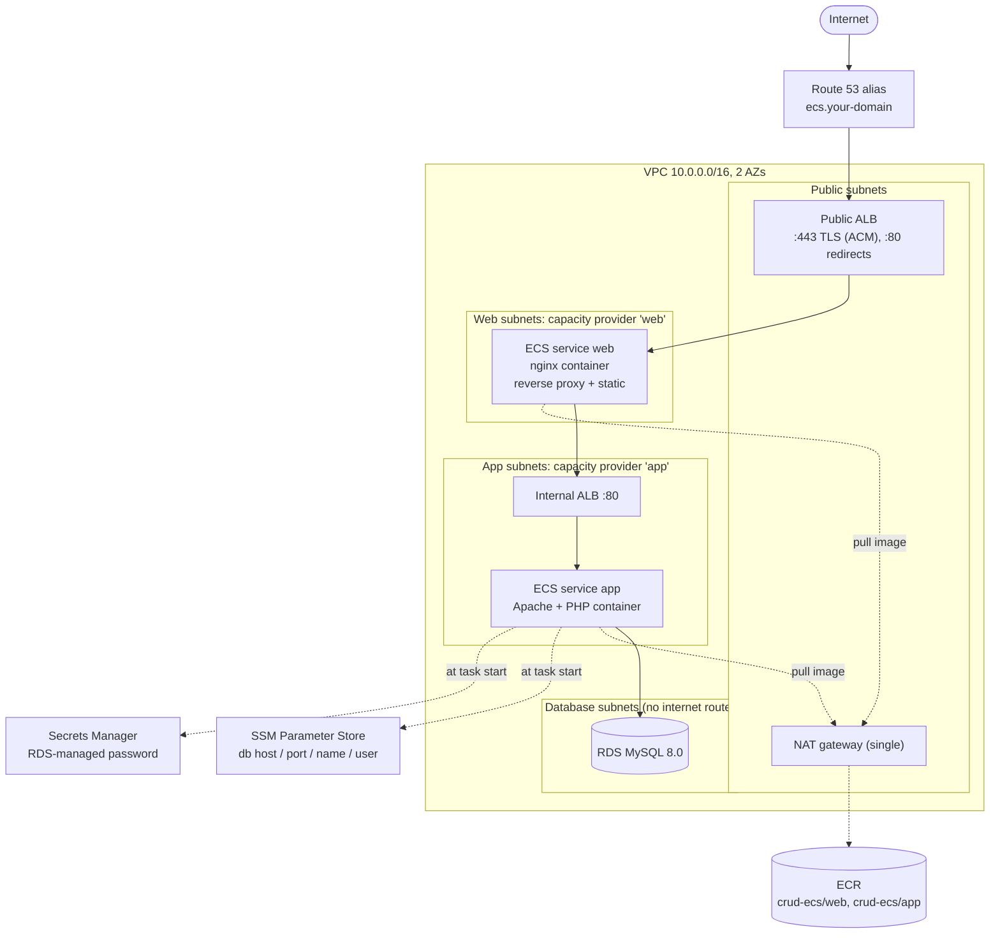

# crud-app-ecs-three-tier

The three-tier PHP CRUD app from [`crud-app-three-tier`](../crud-app-three-tier), moved from
Auto Scaling groups configured by Ansible to **Docker containers on Amazon ECS (EC2 launch
type)**, with the images stored in **ECR**. It is written entirely with
[terraform-aws-modules](https://registry.terraform.io/namespaces/terraform-aws-modules)
registry modules (**no raw `resource` blocks**).

The shape is the same as before: a new VPC, a public ALB, and web / app / database tiers each
in their own private subnets. What changes is how code gets onto the machines. Instead of
instances that install packages and run Ansible at boot, each tier is a Docker image that is
built once, pushed to ECR, and run by ECS.

The Dockerfile it starts from is the PHP example in
[`Docker/crud-app-demo`](../../Docker/crud-app-demo); the changes made to it are listed
under [The Docker images](#the-docker-images).

## Architecture



Each tier only accepts traffic from the tier above it:

```
internet -> public-alb-sg (80/443) -> web-sg (task ports) -> internal-alb-sg (80) -> app-sg (task ports) -> db-sg (3306)
```

`web-sg` and `app-sg` belong to the ECS **container instances** of that tier. There is no SSH
anywhere; shell access to an instance is through SSM Session Manager.

### Life of a request

1. The browser hits `ecs.<your-domain>`. Route 53 resolves it to the public ALB, which
   terminates TLS with the ACM certificate (and redirects `:80` to `:443`).
2. The ALB forwards to an **nginx** task in the web tier. Its target group registers
   `instance:port`, where the port is the dynamic host port Docker gave the container.
3. nginx answers `/healthz` and `/static/` itself and proxies everything else to the
   **internal ALB**. nginx re-resolves the ALB's DNS name every 30 seconds, because the ALB's
   IPs change over time.
4. The internal ALB forwards to an **Apache + PHP** task in the app tier, which talks to
   **RDS** on 3306.

### Life of a deployment

1. `scripts/push-images.sh` builds the images and pushes them to ECR (`latest` plus a content
   hash tag).
2. `terraform apply` looks up the digest behind `latest`. A new digest changes the task
   definition, so Terraform registers a new revision and updates the service.
3. ECS starts the new tasks (up to 200% of the desired count), waits for them to pass the ALB
   health check, drains the old ones, and stops them. If the new tasks never become healthy,
   the **deployment circuit breaker** rolls back to the previous revision.

## Design decisions

The choices that shape this stack, and what was set aside.

| Decision | Chosen | Why | Set aside |
|----------|--------|-----|-----------|
| Where containers run | ECS on **EC2** container instances | Asked for, and it keeps the cost model of the previous stack | Fargate (no instances to manage, higher per-task price) |
| Cluster layout | **One cluster, two capacity providers** (`web`, `app`) | The tiers keep separate subnets, security groups and instance fleets, so the security-group chain from the previous stack survives | One shared fleet for both tiers (would put nginx and PHP on the same instances and blur the SG boundaries) |
| Task networking | **`bridge` with dynamic host ports** | `awsvpc` needs one ENI per task and a `t3.micro` has two, so it would cap a small fleet at one task per instance. Dynamic ports let several tasks share an instance | `awsvpc` (per-task security groups, exact port 80 rules; needs bigger instances or ENI trunking) |
| Instance scaling | ECS **managed scaling** on each capacity provider, with managed termination protection | ECS decides when tasks need more instances and never removes one that is running tasks | ASG CPU policies on instances (they do not know about tasks) |
| Image registry | One **ECR** repository per tier, scan on push, keep the last 10 images | Private, in-account, no rate limits | Docker Hub (rate limits from the NAT IP, public) |
| How a task names its image | By **digest**, resolved from the `latest` tag at plan time | A moving tag never silently changes what is running, and a push plus `apply` is always a real rollout | Immutable unique tags passed in as variables (more ceremony), or `latest` directly (ECS would not redeploy) |
| First deploy | **Three steps**: `-target=module.ecr`, push, full apply | The repositories must exist before you can push, and the images must exist before the services start | A `local-exec` build-and-push inside Terraform (a raw resource, which this stack avoids) |
| DB connection details | **SSM Parameter Store**, injected by ECS as task secrets | Same layout as the previous stack; one place to look; nothing baked into the image | Plain task environment variables (visible in the task definition) |
| DB password | **RDS-managed Secrets Manager secret**, injected by ECS | The password is never in Terraform state, the task definition or the image | A generated password stored by Terraform |
| Schema import | The **app container** applies `schema.sql` at start, under a MySQL advisory lock | RDS does not run it (the compose `mysql` image did); the script is idempotent, so every task can run it | A one-off ECS task or a manual import |
| Web tier | **nginx container** in front of an **internal ALB** | Same as before; the internal ALB gives nginx a stable name for an autoscaling backend | Talking to the app tasks directly |
| Task IAM | An **execution role** per service, **no task role** | The containers call no AWS APIs; the execution role pulls the image and reads the parameters and secret | A shared role for both services |
| Networking | One NAT gateway, database subnets with no internet route | Cheap, and the same as before | One NAT per AZ (the HA option) |
| State | S3 with native locking, own bucket | Same approach as before; its own bucket name so it never collides with the previous project's | Sharing the previous bucket |

## What is in it

| Piece | Module | Notes |
|-------|--------|-------|
| Network | `vpc/aws` 6.7 | Public, web, app and database subnets across 2 AZs, IGW, one shared NAT gateway |
| Security groups (x5) | `security-group/aws` 6.0 | public-alb, web, internal-alb, app, db, chained by security group ID |
| Load balancers (x2) | `alb/aws` 10.5 | Public (HTTPS + HTTP redirect) and internal |
| Container registries (x2) | `ecr/aws` 3.2 | Scan on push, lifecycle policy keeps 10 images, `force_delete` for the demo |
| Container instances (x2) | `autoscaling/aws` 9.3 | ECS-optimized AL2023, IMDSv2 with hop limit 1, encrypted 30 GiB root volume, SSM access |
| Cluster + capacity providers | `ecs/aws` 7.6 | Two capacity providers with managed scaling and managed draining |
| Services (x2) | `ecs/aws//modules/service` 7.6 | Task definition, execution role, service, CPU target tracking, circuit breaker |
| Database | `rds/aws` 7.2 | MySQL 8.0, encrypted, master password generated and held by RDS in Secrets Manager |
| DB connection details (x4) | `ssm-parameter/aws` 2.1 | Host, port, name, user (never the password) |
| Certificate | `acm/aws` 6.3 | DNS-validated, free, auto-renewing |
| DNS record | `route53/aws` 6.5 | Only the `ecs` alias; the zone is looked up, never created |
| State bucket | `s3-bucket/aws` 5.16 | In `bootstrap/`, separate stack with local state |

Only `data` sources sit outside modules: the ECS-optimized AMI (from the public SSM
parameter), the availability zones, the caller identity, the Route 53 zone, the ECR image
digests, and the HTTP request in the post-apply `check`.

### How it runs on ECS

| Piece | How |
|-------|-----|
| Cluster | `module "ecs"` with two capacity providers named `crud-ecs-web` and `crud-ecs-app` (capacity provider names are unique per account and region, hence the prefix) |
| Container instances | `module "ecs_nodes"` (a `for_each` over the two tiers). Each launch template's user data just writes `ECS_CLUSTER` to `/etc/ecs/ecs.config`; Docker and the ECS agent are already on the AMI |
| Services | `svc_web` and `svc_app`, each pinned to its tier's capacity provider, spread across AZs first and then across instances, min 2 / max 4 tasks, CPU target 60% |
| Rolling deploys | Minimum healthy 100%, maximum 200%, circuit breaker with rollback, and `wait_for_steady_state` so `terraform apply` only finishes when the tasks are healthy |
| Health checks | Public ALB to nginx: `/healthz` (answered by nginx). Internal ALB to the app: `/index.php` (a deep check that needs Apache, PHP and the database). Each container also has a light liveness check |
| DB details | ECS reads `/crud-ecs/db/{host,port,name,username}` from Parameter Store and `DB_PASS` from the RDS-managed secret (`<secret-arn>:password::` selects the `password` key) when a task starts, and passes them in as `DB_HOST`, `DB_PORT`, `DB_NAME`, `DB_USER`, `DB_PASS`. The task definition contains only the ARNs. This is in `ecs_services.tf` under `secrets` |
| Logs | CloudWatch Logs groups `/ecs/crud-ecs/web` and `/ecs/crud-ecs/app`, 7 days |

## The Docker images

Built from `docker/`, one directory per tier.

**`docker/app`** is the PHP image (multi-stage `php:8.2-apache`, taken from the
`Docker/crud-app-demo` example). Changes from the example:

- The PHP files moved to `src/`, and only `src/` is copied into Apache's document root. The
  example copied its whole build context there, which would serve `schema.sql`, the
  Dockerfile and the entrypoint over HTTP.
- `schema.sql` is the idempotent version used by the previous stack (the seed row is guarded
  with `WHERE NOT EXISTS`).
- `entrypoint.sh` still waits for the database, and now also runs `init-schema.php` when
  `DB_INIT_SCHEMA=true`. That script applies `schema.sql` statement by statement under a
  MySQL advisory lock (`GET_LOCK`), so several tasks starting together take turns instead of
  racing.

**`docker/web`** is the nginx image and replaces the `nginx_frontend` Ansible role. The
official image renders `/etc/nginx/templates/*.template` with `envsubst` at start, so the
internal ALB's name is passed in as `UPSTREAM_HOST` rather than baked in, and the image
exports the container's DNS servers as `NGINX_LOCAL_RESOLVERS` for the `resolver` directive.
It proxies to the internal ALB, answers `/healthz`, and serves `/static/`.

## Prerequisites

- Terraform `>= 1.11.1` (the RDS module requires it) and the AWS provider `~> 6.0`
- Docker, and the AWS CLI with credentials that can create the resources above
- `python3` (used by `scripts/push-images.sh` to read the Terraform output)
- For HTTPS: a **public Route 53 hosted zone** for a domain you control. The zone is only
  read, so it can live in the same account and be used for other things. Without a domain,
  set `enable_https = false` and the app is served over plain HTTP on the public ALB's own
  DNS name.

## Usage

**1. Create the remote-state bucket (once).** State lives in S3 with native locking
(`use_lockfile`), so there is no DynamoDB table. The bucket is created by a small separate
stack that keeps its own state locally:

```bash
cd bootstrap
terraform init
terraform apply
```

Copy the `state_bucket` output into `backend.hcl` (`bucket = "..."`).

**2. Create the ECR repositories.** The images have to exist before the services can start,
and the repositories have to exist before you can push, so the first deploy has three steps.
This is the first:

```bash
cd ..
terraform init -backend-config=backend.hcl
terraform apply -target='module.ecr'
```

**3. Build and push the images.**

```bash
scripts/push-images.sh          # both tiers; or: scripts/push-images.sh app
```

The script logs in to ECR, builds `docker/web` and `docker/app` for `linux/amd64`, and pushes
each with a content-hash tag and `latest`.

**4. Deploy everything else.**

```bash
terraform plan
terraform apply
```

Set your own domain, either with `-var` or a `terraform.tfvars` file (gitignored):

```hcl
route53_zone_name = "example.com"
app_domain_name   = "ecs.example.com"
# or, with no domain:
# enable_https = false
```

The apply takes a while: RDS and the certificate validation are the slow parts, then the
container instances have to boot and register, and finally the apply waits for both services
to reach a steady state. When it finishes, open the `app_url` output.

Until step 3 has been done, a plain `terraform plan` fails with
`reading ECR Images: couldn't find resource`. That is intentional: it is how the
configuration insists on the images existing before it tries to run them.

### Shipping a change

Edit something under `docker/`, then:

```bash
scripts/push-images.sh
terraform apply        # sees the new digest, registers a new task definition, rolls the service
```

Editing only Terraform needs just the `apply`.

### Looking around a running stack

```bash
CLUSTER=$(terraform output -raw ecs_cluster_name)

# services and their task counts
aws ecs describe-services --cluster $CLUSTER --services crud-ecs-web crud-ecs-app \
  --query 'services[].[serviceName,runningCount,desiredCount,deployments[0].rolloutState]' --output table

# why a task stopped
aws ecs list-tasks --cluster $CLUSTER --desired-status STOPPED
aws ecs describe-tasks --cluster $CLUSTER --tasks <task-arn> --query 'tasks[].stoppedReason'

# logs
aws logs tail /ecs/crud-ecs/app --follow
aws logs tail /ecs/crud-ecs/web --follow

# a shell on a container instance (no SSH; needs the Session Manager plugin)
aws ssm start-session --target <instance-id>
```

### Tear it down

```bash
terraform destroy
```

The demo stack is designed to be disposable: the ECR repositories have `force_delete`,
`db_deletion_protection` is off and `db_skip_final_snapshot` is on. The state bucket is
separate, versioned and has `force_destroy = false`, so to remove it, empty all object versions
and delete markers first (S3 console "Empty bucket" works), then run `terraform destroy` in
`bootstrap/`. The domain and hosted zone are never touched.

## Variables

| Variable | Default | Purpose |
|----------|---------|---------|
| `aws_region` | `us-east-1` | Region |
| `project_name` | `crud-ecs` | Name prefix, tag, and the ECS cluster name |
| `enable_https` | `true` | ACM cert, HTTPS listener, HTTP redirect and DNS record. `false` = HTTP only |
| `route53_zone_name` | `abhidemosite.link` | Existing hosted zone (**change this**) |
| `app_domain_name` | `ecs.abhidemosite.link` | App hostname; must sit inside the zone (**change this**) |
| `allowed_ingress_cidrs` | `["0.0.0.0/0"]` | Who can reach the public ALB |
| `vpc_cidr` / `az_count` | `10.0.0.0/16` / `2` | Network layout (one /24 per AZ per tier) |
| `image_tag` | `latest` | ECR tag deployed for both tiers, resolved to a digest at plan time |
| `web_instance_type` / `app_instance_type` | `t3.micro` | Container instance size per tier |
| `web_node_min_size` / `web_node_max_size` (and `app_`) | `2` / `4` | Bounds of each container-instance fleet; managed scaling moves within them |
| `web_task_cpu` / `web_task_memory` | `256` / `256` | Per-task reservation (CPU units, MiB hard limit) |
| `app_task_cpu` / `app_task_memory` | `256` / `384` | Per-task reservation |
| `web_desired_count` / `_min_count` / `_max_count` (and `app_`) | `2` / `2` / `4` | Task counts per service |
| `cpu_target_percent` | `60` | Target-tracking CPU for both services |
| `log_retention_days` | `7` | CloudWatch Logs retention |
| `enable_container_insights` | `false` | ECS Container Insights (extra CloudWatch cost) |
| `db_engine_version` / `db_instance_class` | `8.0` / `db.t3.micro` | MySQL |
| `db_allocated_storage` | `20` | GiB |
| `db_name` / `db_username` | `php_crud_demo` / `crud_user` | Database and master user |
| `db_multi_az` | `false` | Multi-AZ RDS |
| `db_deletion_protection` / `db_skip_final_snapshot` | `false` / `true` | Demo-friendly teardown |

`db_name` should stay `php_crud_demo` unless you also change the database name in
`docker/app/schema.sql`.

## Outputs

`app_url`, `public_alb_dns_name`, `internal_alb_dns_name`, `ecr_repository_urls`,
`ecs_cluster_name`, `ecs_service_names`, `db_endpoint`, `db_secret_arn`, `nat_public_ip`.

A `check` block in `checks.tf` sends an HTTP request to the app after apply. It only warns
and never fails an apply, so before the app exists (or before DNS resolves) you will see a
warning on `plan`; that is expected.

## Compared with `crud-app-three-tier`

The previous stack runs the same app on instances configured by Ansible. This one keeps the
network, the load balancers, the database and the security-group chain, and changes how the
code is delivered.

| | `crud-app-three-tier` | `crud-app-ecs-three-tier` |
|---|---|---|
| Compute | Two ASGs of instances configured by Ansible at boot | Two ECS services on two container-instance fleets |
| Release unit | Files in S3 plus a content hash in user data, then an ASG instance refresh | A Docker image in ECR, referenced by digest, then a rolling ECS deployment |
| Scaling | ASG target tracking on instance CPU | Service target tracking on task CPU, plus managed scaling of the instance fleet |
| Start-up work | dnf, pip and Ansible on every new instance | Pull the image and start the container |
| DB config | SSM parameters plus Secrets Manager, read by Ansible | The same, injected by ECS as task secrets |
| Bad release | Instance refresh keeps 50% healthy | Circuit breaker rolls back automatically |
| Networking | Instances behind the ALBs on port 80 | Tasks on dynamic ports (`bridge` mode) |
| Things you no longer need | | S3 artifacts bucket, Ansible, per-tier instance IAM policies |
| Things you now need | | ECR, Docker, a build-and-push step |

## Verification

Checked on a live deployment (`us-east-1`, 98 resources applied in one run after the
three-step first deploy, no errors):

- **ECS:** both services at 2 of 2 tasks with rollout `COMPLETED`, running on four container
  instances (two per tier). All four ALB targets healthy on dynamic host ports (`:32768`),
  which confirms `bridge` mode and the security-group rules.
- **Front door:** HTTPS with a valid ACM certificate (Amazon RSA 2048 M01), `http://` answers
  `301` to `https://`, `/healthz` and `/static/robots.txt` return 200.
- **Credentials:** the app task definition holds only ARNs (four SSM parameters and
  `<secret>:password::`); its only plain environment variable is `DB_INIT_SCHEMA`. The
  actual RDS password was fetched and searched for in the pulled Terraform state: **not
  found**.
- **Schema import:** the app log shows `Schema applied (4 statements)` and the seed row exists
  exactly once, although both app tasks started at the same time.
- **CRUD:** create, edit and delete through the full path (ALB, nginx, internal ALB, PHP,
  RDS), each returning `302`.
- **Files that must not be public:** `/schema.sql`, `/Dockerfile`, `/entrypoint.sh` and
  `/init-schema.php` all return `404`.
- **Losing a task:** one app task was stopped while a request loop ran; 60 of 60 requests
  returned 200 and ECS brought the service back to 2 of 2.
- **Idempotence:** after the apply, `terraform plan` reports no changes. Getting there needed
  one fix, described under "Things worth knowing" (`depends_on` on the service modules).

Not yet exercised: a rolling deployment of a changed image, the deployment circuit-breaker
rollback, managed scaling adding an instance under load, and `terraform destroy`.

## Things worth knowing

- **Sizing.** Both tiers default to `t3.micro`. The app task is capped at 384 MiB so that a
  second copy fits on the same instance during a rolling deploy. If you raise
  `app_task_memory`, raise `app_instance_type` too, otherwise a deploy waits for managed
  scaling to add an instance.
- **`bridge` mode and the security groups.** Because tasks sit on dynamic host ports, the
  container-instance groups allow the whole Docker ephemeral range (32768-65535) from the
  ALB above them, and nothing else. In `awsvpc` mode you could allow just port 80, at the
  cost of one ENI per task.
- **The digest lookup is what enforces the push.** `data.aws_ecr_image` reads the digest of
  `latest` at plan time. Before the first push it errors, which is the intended guard. After
  that, a re-tagged image shows up as a task-definition change in the next plan.
- **New AMIs are not rolled automatically.** The launch template follows the latest ECS
  AMI, but existing instances are not replaced (managed termination protection keeps them
  alive). New instances launched by scaling get the new AMI.
- **`destroy` and protected instances.** The container-instance ASGs set `force_delete`,
  otherwise instances protected from scale-in would block their deletion.
- **`lifecycle` cannot be set on a `module` block** (Terraform rejects it), so lifecycle
  behaviour comes from module inputs (`ignore_desired_capacity_changes`, the deployment
  circuit breaker) and from what the modules do internally.
- **`depends_on` on the service modules is kept to a minimum, on purpose.** A module-level
  `depends_on` defers every data source inside that module whenever the dependency has a
  pending change, and here that made Terraform re-register both task definitions (and so roll
  both services) on an unrelated plan. The first version of this stack had
  `depends_on = [module.ecs, ...]` and its follow-up plan wanted to replace both task
  definitions. Now the services are ordered after the cluster's capacity-provider association
  by *reference* (`service_capacity_providers` in `locals.tf`), and `depends_on` only names the
  ALB module that owns the listener (needed at create time, because a target group reference
  does not wait for its listener). Changing that ALB module will still re-register its
  service's task definition.
- **A one-time `time_sleep` replacement.** The ECS module keeps a `time_sleep` whose trigger
  serialises the capacity providers, and the first apply records their `tags` as `null` while
  a refresh reads `{}`. The next plan therefore shows that one resource being replaced;
  applying it (nothing running is touched) settles it, and plans are clean afterwards.
- **A database outage does not restart tasks.** The internal ALB health check is
  `/index.php`, which fails if the database connection is broken, so the ALB stops routing
  to the tasks. The container health check is only a liveness probe on port 80, so ECS does
  not restart them, and they recover on their own when the database returns.
- **The app's document root contains only the PHP files** (see
  [The Docker images](#the-docker-images)).
- **Cost:** the always-on parts are the NAT gateway, two ALBs, four `t3.micro` container
  instances and RDS. Expect on the order of a hundred dollars a month if left running (an
  estimate, not a measurement - check the AWS pricing calculator). `terraform destroy` when
  you are done.
- `backend.hcl` holds an account-specific bucket name; replace it with the one your
  bootstrap run outputs.
