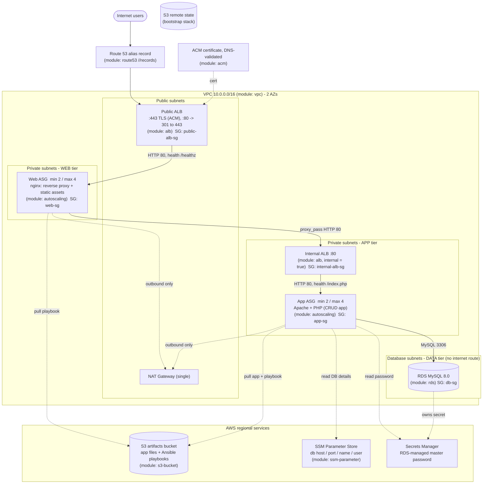

# crud-app-three-tier - plan (v2)

Three-tier version of [`basic-crud-app-tf`](../basic-crud-app-tf): the same PHP CRUD
app, split into **web/proxy (nginx) -> app (Apache/PHP) -> data (RDS)**, each tier in
its own subnets and (for compute) its own Auto Scaling Group. Built **only from
registry modules - no raw `resource` blocks** (just a couple of `data` sources).

> **Status: deployed and verified** at https://app.abhidemosite.link (101 resources, S3
> remote state). Verified: both ASGs healthy behind their ALBs, HTTPS + HTTP redirect,
> create/delete through the full stack, and killing an app instance caused zero failed
> requests while the ASG replaced it. Still costing money - `terraform destroy` when done.

## Architecture



### Security-group chain (each tier only accepts the tier above)

```
0.0.0.0/0 --80,443--> public-alb-sg --80--> web-sg --80--> internal-alb-sg --80--> app-sg --3306--> db-sg
```

No SSH anywhere - shell access via SSM Session Manager only.
TLS terminates at the public ALB; traffic inside the VPC is plain HTTP
(nginx sets `X-Forwarded-Proto`).

### About the "frontend"

The PHP pages are server-rendered, so there is no separate SPA to host. The web tier
is nginx doing two jobs: (1) reverse-proxy everything to the app tier through the
internal ALB, (2) serve static assets (CSS/JS/images) directly. I'll check whether
the app has any assets to extract; if it's all inline today, nginx is mostly the
proxy and we can move CSS into `static/` as a small optional step.

The internal ALB is what lets nginx reach an autoscaling backend (stable DNS name,
health checks, and it follows instances as the app ASG scales). It costs ~$17/mo.

## Modules (all `terraform-aws-modules/*`, no raw resources)

Versions are the current registry releases as of today; I'll pin to their
major/minor (`~> x.y`).

| # | Purpose | Module (version) | Calls |
|---|---------|------------------|-------|
| 1 | VPC, 4 subnet tiers, IGW, single NAT, routes, DB subnet group | `vpc/aws` (6.7.3) | 1 |
| 2 | Security groups: public-alb, web, internal-alb, app, db | `security-group/aws` (6.0.0; output is `.id`, rules are `ingress_rules` maps) | 5 |
| 3 | Public ALB (HTTPS listener, HTTP->HTTPS redirect, target group) | `alb/aws` (10.5.1) | 1 |
| 4 | Internal ALB (HTTP listener, target group) | `alb/aws` (`internal = true`) | 1 |
| 5 | Web fleet: launch template + ASG + instance profile | `autoscaling/aws` (9.3.2) | 1 |
| 6 | App fleet: launch template + ASG + instance profile | `autoscaling/aws` | 1 |
| 7 | MySQL, RDS-managed password in Secrets Manager | `rds/aws` (7.2.2) | 1 |
| 8 | Artifacts bucket + uploaded app files/playbooks | `s3-bucket/aws` (5.16.1) + `//modules/object` | 1 + N |
| 9 | Least-privilege policies (web: read bucket; app: bucket + SSM params + DB secret) | `iam/aws//modules/iam-policy` (6.8.2) | 2 |
| 10 | DB host/port/name/user for Ansible | `ssm-parameter/aws` (2.1.2) | 4 (`for_each`) |
| 11 | Public TLS certificate (free, auto-renewing, DNS-validated) | `acm/aws` (6.3.1) | 1 |
| 12 | DNS alias record -> public ALB (zone is *looked up*, `create_zone = false`) | `route53/aws` (6.5.1; v6 dropped the `//modules/records` submodule) | 1 |
| 13 | Remote-state bucket (separate `bootstrap/` stack) | `s3-bucket/aws` | 1 |
| opt | Free S3 gateway endpoint (skip NAT for S3 traffic) | `vpc/aws//modules/vpc-endpoints` | 1 |
| opt | CloudWatch alarms | `cloudwatch/aws//modules/metric-alarm` | later |

Only `data` sources remain outside modules: the AL2023 AMI (SSM public parameter) and
availability zones.

Provider constraint: modules require `aws >= 6.56` and RDS needs Terraform `>= 1.11.1`,
so we use **AWS provider `~> 6.0`** (the basic project used `~> 5.0`). Your Terraform
1.16.3 is fine.

### Subnet layout (module 1)

| Tier | AZ-a | AZ-b | Holds |
|------|------|------|-------|
| public | 10.0.1.0/24 | 10.0.2.0/24 | public ALB, NAT |
| web (private) | 10.0.11.0/24 | 10.0.12.0/24 | web ASG |
| app (private) | 10.0.21.0/24 | 10.0.22.0/24 | app ASG, internal ALB |
| database | 10.0.31.0/24 | 10.0.32.0/24 | RDS |

The VPC module has one `private_subnets` list; I'll declare 4 private subnets and
split them in `locals` (`[0:2]` web, `[2:4]` app) instead of misusing `intra_subnets`
(which have no NAT route, and the instances need it to run `dnf`/`pip` on first boot).

## Output wiring (build order)

```
vpc -> sg (5) --+-> alb_public -----------------------+
                +-> alb_internal --(dns_name)--> asg_web
                +-> rds -> ssm_parameter (x4) ---+
                |     \-> iam_policy_app --------+--> asg_app --(target group)--> alb_internal
s3_bucket -> s3_object (app + playbooks) --------+
acm -> alb_public listener; route53 records -> alb_public.dns_name / zone_id
```

Key outputs consumed: `vpc.vpc_id / public_subnets / private_subnets /
database_subnet_group_name`, `*_sg.security_group_id`, `alb.target_groups[...].arn`,
`alb.dns_name / zone_id`, `rds.db_instance_address / port / name / username /
db_instance_master_user_secret_arn`, `s3.s3_bucket_id / arn`, `acm.acm_certificate_arn`.

## depends_on and lifecycle

**Constraint found while checking:** Terraform rejects a `lifecycle` block on a
`module` call ("Reserved block type name in module block" - tested on 1.16.3), and
since we're using modules only, lifecycle behaviour comes from (a) what the modules
already do internally and (b) module inputs. `depends_on` *is* allowed on modules.

### `depends_on` (only where a reference doesn't already order things)

| Module | depends_on | Why |
|--------|-----------|-----|
| `asg_app` | `module.vpc`, `module.rds`, `module.db_params`, `module.artifacts_objects` | Instances run Ansible at first boot: they need the **NAT route** (referencing subnet IDs alone does *not* wait for the NAT/route table), the DB up, the SSM params written and the files in S3 |
| `asg_web` | `module.vpc`, `module.alb_internal`, `module.artifacts_objects` | nginx needs NAT + the internal ALB DNS name resolvable + playbook in S3 |
| `alb_public` | `module.acm` (only if `enable_https`) | HTTPS listener needs a *validated* cert (acm module waits for validation) |
| `dns_records` | `module.alb_public` | alias target must exist |
| `db_params` | `module.rds` | Explicit ordering in addition to value refs |

### Lifecycle behaviour, via module inputs / built-ins

Confirmed present in module source: `create_before_destroy` is already set inside
`security-group`, `alb`, `autoscaling`, `acm` and `vpc`, so replacements of SGs, ALB
target groups, launch templates/ASGs and certs are zero-downtime-ordered with no
extra work from us.

| Concern | How |
|---------|-----|
| Ignore drift from scaling policies | ASG `ignore_desired_capacity_changes = true` (replaces `ignore_changes = [desired_capacity]`) |
| Roll out new AMI / userdata / playbook without downtime | ASG `instance_refresh` (rolling, `min_healthy_percentage = 50`, triggers on launch template change); app-file hash is baked into userdata so an app change refreshes the fleet |
| Slow first boot (Ansible) not treated as unhealthy | ASG `health_check_type = "ELB"`, `health_check_grace_period ~ 300`, `wait_for_capacity_timeout` |
| Protect the database | RDS `deletion_protection` (variable, **off by default for the demo**), `skip_final_snapshot` (variable, on for demo), `apply_immediately` off, `backup_retention_period` |
| Protect state bucket | bootstrap bucket: versioning on, `force_destroy = false`, deny-insecure-transport policy |
| Sanity checks | root-level `check {}` block (HTTP GET on the app URL after apply) and `variable` `validation {}` blocks (e.g. `app_domain_name` must sit inside `route53_zone_name`); `lifecycle` `precondition`s can't be used without raw resources, so validations + checks fill that gap |

## Domain and HTTPS

`abhidemosite.link` is **registered** (Route 53, auto-renew on, expires 2027-09-19) and
its hosted zone `Z0583082E32E7MU0P5FN` exists. It is split in two:

| Name | Goes to | Managed by |
|------|---------|-----------|
| `abhidemosite.link` (apex), `www` | GitHub Pages - your projects blog | **not this stack** (manual, or a separate tiny stack) |
| `app.abhidemosite.link` | public ALB -> the CRUD demo | **this stack** |

**Teardown safety:** the domain and zone are *out of scope for Terraform*: this stack only
reads the existing zone through a `data` block (and the route53 module with
`create_zone = false`) and never creates or owns it and manages exactly two things in it: the `app` alias record and the ACM
validation CNAME. `terraform destroy` therefore removes the demo but leaves the zone,
the domain and the blog's apex/`www` records alone.

- The demo URL is a **variable** (`app_domain_name`, default `app.abhidemosite.link`);
  the zone is another (`route53_zone_name`, default `abhidemosite.link`). Change them and
  the ACM cert, the ALB listener and the DNS record follow. A `validation {}` block
  checks that `app_domain_name` ends with `route53_zone_name`.
- HTTPS is **on by default** now that the domain exists (`enable_https = true`). Setting
  it to `false` builds HTTP-only on the ALB's own DNS name.
- Certificate: `acm` module, DNS-validated in that zone, free and auto-renewing. Certbot
  is not used (an ALB can only use ACM certs).
- Registration itself was the one manual step; the modules can't register domains.

### GitHub Pages blog (outside this stack)

Apex + `www` in the same hosted zone, pointing at GitHub Pages (a public repo, Settings ->
Pages -> custom domain, "Enforce HTTPS"):

| Name | Type | Value |
|------|------|-------|
| `abhidemosite.link` | A | `185.199.108.153`, `185.199.109.153`, `185.199.110.153`, `185.199.111.153` |
| `abhidemosite.link` | AAAA | the four GitHub Pages IPv6 addresses (from GitHub's docs) |
| `www` | CNAME | `<github-username>.github.io` |

Verify the IPs against GitHub's custom-domain docs when we get there. These go in a
separate step so tearing down the demo can't touch them.

## Remote state (S3)

Two stacks, because the state bucket can't store its own creation:

1. `bootstrap/` - `s3-bucket` module only, **local state**, versioning + SSE +
   block-public-access. Applied once.
2. Main stack - `backend "s3" { key = "crud-app-three-tier/terraform.tfstate"  use_lockfile = true }`.
   Native S3 locking (Terraform >= 1.10), so **no DynamoDB table** needed.
   The bucket name is a `-backend-config` value or checked-in constant.

## What changes vs. `basic-crud-app-tf`

| Area | Basic | Three-tier |
|------|-------|-----------|
| Network | default VPC, public subnet | dedicated VPC, 4 subnet tiers, 2 AZs |
| Compute | 1 EC2, public IP | 2 ASGs (nginx web, Apache/PHP app) in private subnets, no public IPs |
| Entry | instance public IP, HTTP | `app.abhidemosite.link` -> public ALB, HTTPS (HTTP redirects) |
| DB password | `random_password` + SSM SecureString | RDS-managed in Secrets Manager, never in state |
| SGs | ec2, rds | public-alb, web, internal-alb, app, db |
| State | local | S3 + native lock |
| Resource style | ~25 raw resources | ~20 module calls, 0 raw resources |
| Ansible | one playbook | `web.yml` (nginx) + `app.yml` (Apache/PHP); app reads password from Secrets Manager |

### Ansible: one role per tier

```
ansible/
├── web.yml                      roles: [nginx_frontend]   (--extra-vars upstream_host=<internal ALB DNS>)
├── app.yml                      roles: [php_backend]      (--extra-vars aws_region ssm_prefix db_secret_arn)
└── roles/
    ├── nginx_frontend/          install nginx, template nginx.conf (reverse proxy, /healthz,
    │   ├── tasks/ handlers/      /static/, runtime DNS re-resolution of the internal ALB)
    │   ├── templates/nginx.conf.j2
    │   └── defaults/
    └── php_backend/             install Apache/PHP + mysql client, read DB host/port/name/user
        ├── tasks/ handlers/      from SSM and the password from Secrets Manager, deploy app,
        └── defaults/             wait for RDS, import schema, start httpd
```

Userdata stays tiny: `aws s3 sync` the roles (and app), install `ansible-core`, run the
tier's playbook. A content hash of the synced files is embedded in userdata, so any role
or app change alters the launch template and triggers an ASG instance refresh.

Other app changes: `schema.sql`'s seed row is now `INSERT ... WHERE NOT EXISTS`
(every instance runs the import); health checks are public ALB -> web `/healthz`
and internal ALB -> app `/index.php`.

## Layout (as built)

```
crud-app-three-tier/
├── PLAN.md
├── bootstrap/main.tf            state bucket (local state, applied once)
├── versions.tf  backend.tf  backend.hcl  providers.tf  variables.tf  locals.tf  data.tf
├── network.tf                   module "vpc"
├── security_groups.tf           5x module "security-group"
├── alb_public.tf                module "alb_public"
├── alb_internal.tf              module "alb_internal"
├── web_asg.tf                   module "asg_web"
├── app_asg.tf                   module "asg_app"
├── database.tf                  module "rds" + module "db_params" (x4)
├── storage.tf                   module "artifacts_bucket" + module "artifact_files" (for_each)
├── iam.tf                       module "web_policy" + module "app_policy"
├── dns.tf                       module "acm" + module "dns_records"  (both count = enable_https)
├── checks.tf                    post-apply HTTP smoke test (warns only)
├── outputs.tf
├── templates/{web,app}-userdata.sh.tpl
├── ansible/                     web.yml, app.yml, roles/{nginx_frontend,php_backend}
└── crud-app/                    copy of the PHP app
```

## Defaults

| Setting | Default |
|---------|---------|
| Region / AZs | `us-east-1` / 2 |
| NAT | single gateway |
| Web ASG | min 2 / desired 2 / max 4, `t3.micro`, target-tracking CPU 60% |
| App ASG | min 2 / desired 2 / max 4, `t3.micro`, target-tracking CPU 60% |
| RDS | MySQL 8.0, `db.t3.micro`, 20 GiB, encrypted, single-AZ (`multi_az` variable) |
| Domain | `app_domain_name = "app.abhidemosite.link"` in zone `abhidemosite.link` (both variables) |
| HTTPS | on (`enable_https = true`); ACM cert for `app_domain_name` |

## Cost (us-east-1, rough, 24/7 - approximate, please sanity-check)

NAT ~$33 + 2 ALBs ~$33 + 4x t3.micro ~$30 + db.t3.micro + storage ~$15 =
**roughly $110/month, ~$3.5/day**, plus the domain (already paid, $5/yr, plus $0.50/month for the hosted zone). Running with
min 1 per ASG during development trims ~$15. `terraform destroy` when idle.

## Decisions so far

- Community `terraform-aws-modules/*`; RDS-managed Secrets Manager password; single NAT
- Web/proxy (nginx) ASG + backend (Apache/PHP) ASG behind an internal ALB
- S3 remote state with native locking
- Demo URL `app.abhidemosite.link` as a variable; apex stays on GitHub Pages
- Stack is temporary: torn down after the demo

## Resolved

Internal ALB between nginx and the app: yes. `crud-app/` copied into this folder: yes.
Ansible stays, organised as one role per tier: yes.

## Build steps once approved

1. `bootstrap/` -> apply state bucket; scaffold main stack + backend
2. VPC + SGs -> `validate`
3. RDS + S3 + SSM params + IAM
4. Internal ALB + app ASG (+ playbook/schema changes)
5. Public ALB + web ASG (+ nginx playbook)
6. `plan` review together -> apply -> verify (health checks, CRUD via the ALB, kill an
   instance, watch instance refresh)
7. ACM + Route 53 `app` record, HTTPS listener; README + architecture.svg
