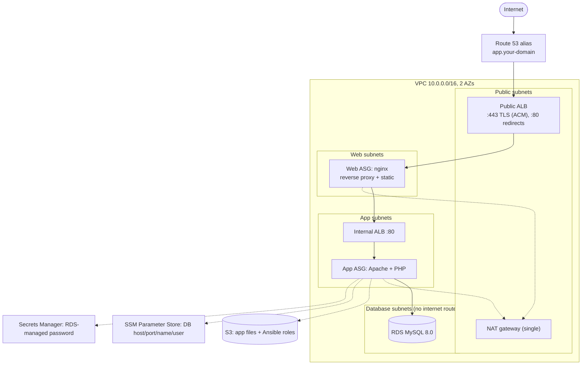

# crud-app-three-tier

A three-tier AWS deployment of the PHP CRUD demo app, written entirely with
[terraform-aws-modules](https://registry.terraform.io/namespaces/terraform-aws-modules)
registry modules (18 module calls, **no raw `resource` blocks**) and configured at
boot with Ansible.

It is the next step after [`basic-crud-app-tf`](../basic-crud-app-tf), which runs the
same app on a single EC2 instance. `PLAN.md` holds the design notes and the reasoning
behind the choices; this file is about running it.

## Architecture



A draw.io version is in [`architecture.drawio`](./architecture.drawio).

Each tier only accepts traffic from the tier above it:

```
internet -> public-alb-sg (80/443) -> web-sg (80) -> internal-alb-sg (80) -> app-sg (80) -> db-sg (3306)
```

There is no SSH anywhere; shell access is through SSM Session Manager.

## What is in it

| Piece | Module | Notes |
|-------|--------|-------|
| Network | `vpc/aws` 6.7 | Public, web, app and database subnets across 2 AZs, one shared NAT gateway |
| Security groups (x5) | `security-group/aws` 6.0 | public-alb, web, internal-alb, app, db, chained by security group ID |
| Load balancers (x2) | `alb/aws` 10.5 | Public (HTTPS + HTTP redirect) and internal |
| Web and app fleets (x2) | `autoscaling/aws` 9.3 | Launch template, ASG, instance profile, CPU target tracking, rolling instance refresh |
| Database | `rds/aws` 7.2 | MySQL 8.0, encrypted, master password generated and held by RDS in Secrets Manager |
| DB connection details | `ssm-parameter/aws` 2.1 | Host, port, name, user (never the password) |
| Artifacts | `s3-bucket/aws` 5.16 (+ `//modules/object`) | App files and Ansible roles pulled by instances at boot |
| Instance policies (x2) | `iam/aws//modules/iam-policy` 6.8 | Least privilege per tier |
| Certificate | `acm/aws` 6.3 | DNS-validated, free, auto-renewing |
| DNS record | `route53/aws` 6.5 | Only the `app` alias; the zone is looked up, never created |

Only `data` sources sit outside modules: the Amazon Linux 2023 AMI (from the public SSM
parameter), the availability zones, the caller identity, the Route 53 zone, and the HTTP
request in the post-apply `check`.

### Ansible roles

Instances install Ansible at first boot, sync `ansible/` (and, for the app tier, the
PHP app) from S3, and run one playbook each:

- `roles/nginx_frontend` (via `web.yml`): installs nginx, proxies everything to the
  internal ALB (re-resolving its DNS name at request time), answers `/healthz` itself so
  web instances do not flap when the backend does, and serves `/static/`.
- `roles/php_backend` (via `app.yml`): installs Apache and PHP, reads the DB details
  from SSM and the password from Secrets Manager, deploys `crud-app/`, waits for RDS,
  and imports `schema.sql` (idempotent, so every instance can run it).

A hash of the relevant files is embedded in each launch template's user data, so
changing a role or the app rolls the affected fleet automatically through an ASG
instance refresh.

## Prerequisites

- Terraform `>= 1.11.1` (the RDS module requires it) and the AWS provider `~> 6.0`
- AWS credentials with permission to create the resources above
- For HTTPS: a **public Route 53 hosted zone** for a domain you control. The zone is only
  read, so it can live in the same account and be used for other things (for example, a
  blog on the apex). Without a domain, set `enable_https = false` and the app is served
  over plain HTTP on the ALB's own DNS name.

## Usage

**1. Create the remote-state bucket (once).** State lives in S3 with native locking
(`use_lockfile`), so there is no DynamoDB table. The bucket is created by a small
separate stack that keeps its own state locally:

```bash
cd bootstrap
terraform init
terraform apply
```

Copy the `state_bucket` output into `backend.hcl` (`bucket = "..."`).

**2. Deploy the stack.**

```bash
cd ..
terraform init -backend-config=backend.hcl
terraform plan
terraform apply
```

Set your own domain, either with `-var` or a `terraform.tfvars` file (gitignored):

```hcl
route53_zone_name = "example.com"
app_domain_name   = "app.example.com"
# or, with no domain:
# enable_https = false
```

The apply takes several minutes; RDS and the certificate validation are the slow parts.
Instances need a few more minutes after that to finish Ansible and pass their health
checks. Then open the `app_url` output.

**3. Tear it down.**

```bash
terraform destroy
```

The demo stack is designed to be disposable: `db_deletion_protection` is off and
`db_skip_final_snapshot` is on by default. The state bucket is separate, versioned and has
`force_destroy = false`, so to remove it, empty all object versions and delete markers
first (S3 console "Empty bucket" works), then run `terraform destroy` in `bootstrap/`.
The domain and hosted zone are never touched.

## Variables

| Variable | Default | Purpose |
|----------|---------|---------|
| `aws_region` | `us-east-1` | Region |
| `project_name` | `crud-3tier` | Name prefix and tag |
| `enable_https` | `true` | ACM cert, HTTPS listener, HTTP redirect and DNS record. `false` = HTTP only |
| `route53_zone_name` | `abhidemosite.link` | Existing hosted zone (**change this**) |
| `app_domain_name` | `app.abhidemosite.link` | App hostname; must sit inside the zone (**change this**) |
| `allowed_ingress_cidrs` | `["0.0.0.0/0"]` | Who can reach the public ALB |
| `vpc_cidr` / `az_count` | `10.0.0.0/16` / `2` | Network layout (one /24 per AZ per tier) |
| `web_*` / `app_*` | `t3.micro`, min 2, desired 2, max 4 | Instance type and ASG sizes per tier |
| `cpu_target_percent` | `60` | Target-tracking CPU for both ASGs |
| `health_check_grace_period` | `300` | Seconds ASGs ignore ELB health while Ansible runs |
| `db_engine_version` / `db_instance_class` | `8.0` / `db.t3.micro` | MySQL |
| `db_allocated_storage` | `20` | GiB |
| `db_name` / `db_username` | `php_crud_demo` / `crud_user` | Database and master user |
| `db_multi_az` | `false` | Multi-AZ RDS |
| `db_deletion_protection` / `db_skip_final_snapshot` | `false` / `true` | Demo-friendly teardown |

`db_name` should stay `php_crud_demo` unless you also change the database name in
`crud-app/schema.sql`.

## Outputs

`app_url`, `public_alb_dns_name`, `internal_alb_dns_name`, `db_endpoint`, `db_secret_arn`,
`artifacts_bucket`, `web_asg_name`, `app_asg_name`, `nat_public_ip`.

A `check` block in `checks.tf` sends an HTTP request to the app after apply. It only
warns and never fails an apply, so before the app exists (or before DNS resolves) you will
see a warning on `plan`; that is expected.

## Compared with `basic-crud-app-tf`

The basic version is intentionally minimal. This one keeps the same app and moves it to
a structure that can lose an instance without losing the site.

| | `basic-crud-app-tf` | `crud-app-three-tier` |
|---|---|---|
| Compute | One EC2 instance | Two ASGs (nginx, Apache/PHP), min 2 each, across 2 AZs |
| Network | Default VPC | Dedicated VPC with public, web, app and database subnets |
| Entry point | Instance public IP, HTTP | Route 53 alias to an ALB, HTTPS with ACM |
| Database password | Generated by Terraform, stored in SSM | Generated and held by RDS in Secrets Manager (never in state) |
| State | Local | S3 with native locking |
| Terraform style | 21 raw resources | 18 module calls, no raw resources |
| Config management | One Ansible playbook | One Ansible role per tier |

## Verification

Checked on a live deployment: both ALBs' targets healthy, HTTPS with a valid certificate
and an HTTP-to-HTTPS redirect, create and delete through the full request path, and one
app instance terminated during a request loop (30 of 30 requests returned 200 while the ASG
replaced it). The stack was then destroyed and the account swept for leftovers.

## Things worth knowing

- **`lifecycle` cannot be set on a `module` block** (Terraform rejects it), so lifecycle
  behaviour comes from module inputs (`ignore_desired_capacity_changes`,
  `instance_refresh`, health-check grace period) and from what the modules already do
  internally (`create_before_destroy` on security groups, ALBs, ASGs, ACM and the VPC).
- **The ASGs use a module-level `depends_on`** (VPC, RDS, SSM parameters, S3 objects).
  Referencing subnet IDs does not wait for the NAT route, and instances need outbound
  internet at first boot. A side effect: the ASG modules' IAM roles show a no-op
  "known after apply" change on every plan.
- **First-launch failures can be transient.** During one apply the web ASG's first two
  launch attempts failed with "Authentication Failure" and then recovered on their own,
  leaving the resource tainted in state. `terraform untaint` on the ASG followed by an
  apply finished the job.
- **Cost:** the always-on parts are the NAT gateway, two ALBs, four instances and RDS.
  Expect on the order of a hundred dollars a month if left running (an estimate, not a
  measurement - check the AWS pricing calculator). `terraform destroy` when you are done.
- `backend.hcl` holds an account-specific bucket name; replace it with the one your
  bootstrap run outputs.
